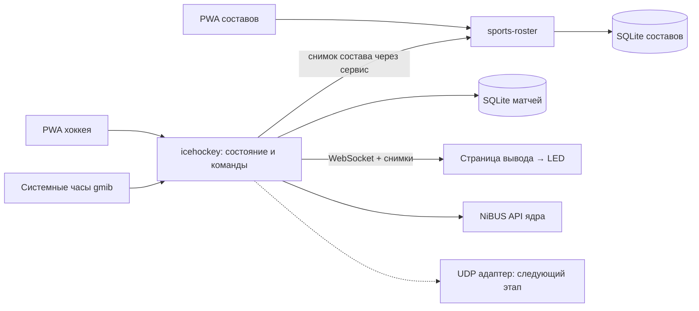

# План спортивных плагинов gmib: составы и хоккей

Дата: 2026-09-14. Статус: первая реализация MVP готова к аппаратной приёмке.

Реализованы API 1.1 (SQLite, сервисы, optionalDependencies, lifecycle, часы), `sports-roster`,
самостоятельный `icehockey`, локальные PWA, страницы LED и NiBUS. UDP и LAN-планшеты отложены.
Актуальные инструкции и ограничения находятся в README каждого плагина в gmib-plugins.

Уточнения реализации к исходному плану ниже:

- Хоккей хранит транзакционные JSON-снимки в SQLite (`matches`, `current_match`, `commands`),
  отдельные таблицы игроков/штрафов пока не требуются. Составы нормализованы в своей SQLite-базе.
- UI использует автономные HTML/CSS/JS без стороннего runtime; архивы остаются небольшими.
- Резервная копия составов — версионированный JSON с транзакционным восстановлением.
- `send*` NiBUS подтверждает постановку в очередь; физическое отображение ещё нужно проверить.
- Проверены тесты ядра, тесты плагинов и браузерный сценарий. Автозапуск на рабочем LED и
  физическая задержка NiBUS пока не проверены; целевые дисплей и устройство не заданы.

## Результат первой версии

gmib запускается с главным окном, скрытым в трей, восстанавливает выбранный вывод на LED-экран.
Оператор открывает локальную PWA, вводит названия команд и ведёт хоккейный матч.
Плагин `icehockey` работает самостоятельно без базы составов. При установленном `sports-roster`
дополнительно доступны выбор команд и заявки.
Закрытие PWA, перезагрузка страницы и сворачивание gmib не останавливают матч.
Интернет для работы не нужен. Один активный матч и один управляющий оператор на установку;
просмотр возможен в нескольких локальных окнах.

Первый комплект — два независимо устанавливаемых плагина:

- `sports-roster`: общая база участников, команд и составов; самостоятельная WebUI/PWA.
- `icehockey`: настройки и состояние хоккейного матча, PWA-пульт, страницы LED-вывода.

Следующие виды спорта добавляются отдельными плагинами с тем же контрактом составов.
UDP и управление с сетевых планшетов — отдельные последующие этапы.

## Что подтверждено по исходникам

| Область | Текущая реализация | Следствие для плана |
| --- | --- | --- |
| Плагины gmib | API 1.0: CommonJS backend, HTTP, JSON storage, WebSocket publish, страницы вывода | Можно использовать существующий сервер и установку `.gmib-plugin` |
| Хранилище | В gmib используется `sqlite3`; данные плагинов пока записываются в `state.json` | Добавить управляемый SQLite API, не поставлять нативный драйвер в каждом плагине |
| Жизненный цикл | Плагины активируются до создания главного окна; зависимости и cleanup API отсутствуют | Добавить порядок загрузки, освобождение ресурсов и готовность сервисов |
| Вывод | `registerPage` добавляет страницу в «Вывод» | Регистрация страницы сама по себе не включает LED-вывод; нужен явный профиль запуска |
| Фоновый запуск | Есть `autostart`, `localGmibHidden`, восстановление плееров | Использовать существующие механизмы, проверить запуск без взаимодействия с gmib |
| NiBUS | Сервис находится в main, клиентская сессия — в preload gmib | Создать независимый от окна адаптер для backend плагинов |
| Matchpad | SQLite/Prisma, `Participant`, `Team`, `ParticipantToTeam`, `Competition`, `TeamToCompetition`, `PlayerState` | Перенести разделение справочника и конкретного матча, сократить поля и связи |
| Matchpad NiBUS | Таймер: reports 5 и 50; счёт: 6/7; период: 8; штрафы: 28 | Сохранить совместимые кодеки и проверить их эталонными кадрами |
| Matchpad UDP | JSON `tick`/`scoreboard`, `zone`, multicast `232.10.11.12:55000` | Второй транспорт проектировать совместимым с этими сообщениями |

Опорные файлы:

- gmib: `packages/common/plugins.ts`, `packages/main/src/pluginHost.ts`, `pluginManifest.ts`,
  `server.ts`, `db.ts`, `index.ts`, `mainWindow.ts`, `playerWindow.ts`, `nibus.ts`,
  `packages/preload/gmib/nibus.ts`.
- gmib-plugins: `AGENTS.md`, `gmib-plugin-api.d.ts`, `scripts/lib.mjs`,
  `plugins/parking-counter` как образец упаковки и маршрутов.
- Matchpad: `prisma/schema.prisma`, `src/lib/timekeeper.ts`, `timer.ts`,
  `IceHockeyPenalty.ts`, `nibus/index.ts`, `nibus/common.ts`, `nibus/structs.ts`,
  `broadcaster.ts`, `fromUConsole.ts`, `test-data/nibus-hockey-scenarios`.

## Границы компонентов



Ядро gmib предоставляет инфраструктуру: часы, SQLite, реестр плагинов/сервисов,
управление разрешённым выводом, NiBUS и жизненный цикл.
Хоккейные правила и состояние остаются в `icehockey`, справочники — в `sports-roster`.
Общий код браузерного клиента и таймера собирается внутрь архивов; отдельный третий обязательный
runtime-плагин для него не нужен. Не переносим Next.js, Prisma runtime и аппаратный стек Matchpad.

## Расширение Plugin API

Предлагаемая версия — 1.1 с сохранением поддержки существующих плагинов 1.0.
Новые плагины требуют `gmibApi: ^1.1.0`. Типы и валидация синхронно обновляются в обоих репозиториях,
включая каталог, сборщик и проверку архивов.

1. **Зависимости и обнаружение.** Добавить `dependencies` с диапазонами версий и
   `contributes.sports` с `id`, названием, версией схемы состава и допустимыми позициями.
   `sports-roster` у хоккея указан только в `optionalDependencies`; его отсутствие, отключение,
   несовместимость и ошибка не блокируют хоккей. Для хоккея использовать стабильный `sportId: icehockey`, как в Matchpad.
   Хост сначала читает все манифесты, затем активирует зависимости в правильном порядке;
   выявляет циклы, отсутствующие зависимости, несовместимость и дубли sportId.
   `context.plugins.listSports()` возвращает отдельно installed/enabled/ready и причины недоступности.
   Благодаря предварительному чтению манифестов нет цикла: roster видит спорт до запуска hockey.

2. **Межплагинный сервис.** `context.services.provide/require` с версионированными контрактами
   и объявленными зависимостями. `sports-roster` предоставляет `sports.rosters/v1`:
   `listTeams`, `getTeam`, `listMembers`, `createRosterSnapshot`.
   Изменение справочников выполняется через backend/WebUI roster. При наличии roster хоккей получает снимки через
   сервис, без прямого SQL-доступа к чужой базе и без внутренних HTTP-запросов.

3. **SQLite.** `context.database.open(name, migrations)` открывает базу только своего плагина;
   параметризованные операции, сериализованные транзакции, версии схемы, backup/restore.
   Путь определяет хост: `<userData>/plugins/.data/<plugin-id>/<name>.sqlite3`.
   Используется уже поставляемый gmib драйвер. `storage` остаётся для небольших настроек.

4. **Часы.** `context.clock.now()` — монотонное время в миллисекундах;
   `context.clock.onSuspend/onResume` — уведомления о приостановке компьютера.
   Это источник времени, а не отдельный аппаратный таймер.

5. **Вывод.** `context.output.getStatus/start/stop` управляет только привязанным к плагину
   профилем вывода. Профиль хранит дисплей, геометрию, страницу и запуск при старте gmib.
   Ручное назначение профиля выполняется один раз; повторный запуск не создаёт дубликаты.

6. **Жизненный цикл.** `context.lifecycle.onDispose` освобождает подписки, таймеры, базы и
   права отправки при ошибке активации и завершении gmib. Горячую переустановку не включаем в MVP:
   обновление/включение по-прежнему требует перезапуска. Активному матчу не предлагаем обновляться.

Новые разрешения: `database`, `services.provide`, `services.consume`, `plugins.read`,
`output.control`, `nibus.read`, `nibus.write`. Доступ к конкретному сервису и профилю дополнительно
проверяется хостом. Backend по текущей архитектуре является доверенным Node-кодом;
эти разрешения ограничивают официальный API, но не создают процессную песочницу.

## Общая база составов

Одна база справочников принадлежит `sports-roster`. База матчей принадлежит спортивному плагину;
справочники между спортивными плагинами не дублируются.

| Таблица | Минимальные данные |
| --- | --- |
| `sports` | Стабильный id и сохранённое описание спорта; доступность вычисляется из реестра хоста |
| `teams` | id, sportId, полное/короткое название, город, цвета, ссылка на эмблему |
| `participants` | id, имя, фамилия, короткое имя; человек может участвовать в нескольких составах |
| `team_members` | teamId, participantId, номер строкой, позиция, роль, активность |
| `assets` | Эмблемы с типом и размером; небольшие файлы можно хранить BLOB в SQLite |
| `schema_migrations` | Применённые миграции |

Позиции и роли задаёт описание спорта; для MVP хоккея достаточно игрока/вратаря и отметки капитана.
Внешние ключи, уникальность участника и непустого номера внутри состава, проверка sportId.
Команды относятся к конкретному спорту, люди общие. Удаление используемых записей заменяется архивированием.
Отключение или удаление спортивного плагина сохраняет составы: WebUI показывает спорт как недоступный.
Резервное копирование/восстановление справочника входит в MVP; массовый импорт Matchpad — отдельная задача.

При создании матча копируются имена, номера, роли, названия и оформление команд.
Ссылки на исходные id сохраняются для сопоставления, но показ матча не зависит от последующих правок БД.
Обновление состава из справочника допустимо явно до начала игры.

## Хоккей light

Первый выпуск рассчитан на ручное судейское управление:

- создание матча, хозяева/гости, выбор заявки из составов;
- счёт +/−, прямое исправление и отмена ошибочной команды;
- номер периода, настраиваемая длительность, старт/пауза/коррекция времени;
- перерыв, тайм-аут, овертайм; переходы запускает оператор;
- штраф игроку с номером и длительностью: 2/4/5 минут и произвольное значение;
- штрафы идут только вместе с игровым временем, сохраняют остаток между периодами,
  скрываются и передают очистку в NiBUS при достижении нуля;
- ручные снятие, редактирование и постановка штрафа в ожидание;
- экран счёта и отдельная страница составов, переключаемые из пульта;
- список сохранённых игр, возобновление незавершённой и завершение текущей.

Полный автомат правил удалений (совпадающие штрафы, освобождение после гола, последовательные части
двойного малого, отложенное начало при нескольких удалениях), турниры, статистические протоколы,
резервные контроллеры и аппаратный HID не входят в MVP. Пульт явно оставляет эти решения оператору.
Несколько штрафов можно хранить одновременно; LED/NiBUS показывают поддерживаемое профилем число,
а пульт показывает весь список и не теряет скрытые штрафы.

Минимальные таблицы хоккея: `matches`, `match_teams`, `match_players`, `penalties`,
`match_state`, `match_commands`. В команде сохраняются id, revision, полезная нагрузка и результат.
Изменение состояния и запись команды выполняются одной транзакцией; после commit рассылается событие.
История команд нужна для дедупликации и исправлений, полноценный event sourcing не требуется.

## Системный таймер и восстановление

Авторитетное состояние живёт в backend основного процесса gmib. Остаток вычисляется как
`remainingAtStartMs - (monotonicNowMs - startedAtMs)`; вызов интервала только запускает пересчёт.
Задержка event loop не накапливает потерянные тики, перевод системных часов не меняет счёт времени.
Штрафы используют накопленное игровое время, поэтому перерыв и тайм-аут их не уменьшают.

PWA и LED получают revision, sessionId, снимок часов и время сервера; локально интерполируют
показания между синхронизациями. После reconnect всегда запрашивают свежий снимок.
Нулевой остаток фиксируется backend один раз и одновременно попадает в LED, пульт и NiBUS.

Сохраняем состояние при каждой команде и периодические контрольные снимки, первоначально раз в секунду.
При штатном выходе таймер ставится на паузу и записывается точное состояние.
После аварии матч восстанавливается на паузе с отметкой времени последнего снимка;
оператор проверяет/корректирует время. Монотонные метки между запусками не переиспользуются.
После сна также требуется пауза и сверка; фоновая работа PWA и сон компьютера — разные ситуации.
При задержке записи показывается давность снимка: секундный интервал не гарантирует секундную потерю
при зависшем процессе или диске.

## Высокоуровневый NiBUS API

Предлагаемый контракт (названия новые; это не существующие методы):

```ts
context.nibus.listConnections(): Promise<ConnectionInfo[]>;
context.nibus.onConnectionChange(handler): Unsubscribe;
context.nibus.onInformationReport({ connectionId, source, kinds }, handler): Unsubscribe;
context.nibus.acquireOutput({ connectionId, target, profile }): Promise<ScoreboardOutput>;

interface ScoreboardOutput {
  sendTimer(state: TimerState): Promise<SendResult>;
  sendScoreboard(state: ScoreboardState): Promise<SendResult>;
  sendPenalties(state: PenaltiesState): Promise<SendResult>;
  sendTeams(state: TeamsState): Promise<SendResult>;
  release(): Promise<void>;
}
```

`TimerState` содержит значение в миллисекундах, направление, running и назначение таймера.
`ScoreboardState` содержит счёт обеих сторон и период, опционально тайм-ауты/фолы для следующих видов.
`PenaltiesState` содержит обе стороны, номера игроков и остатки; пустой список означает очистку.
`TeamsState` содержит названия и сокращения; расширенную передачу персональных составов можно добавить позже.
`SendResult` означает передачу в транспорт или ошибку, а не подтверждённое отображение аппаратным табло.

События приходят как discriminated union: `timer`, `score`, `period`, `penalties`, `teamName`,
с указанием источника и соединения. Неизвестные отчёты учитываются диагностикой хоста;
плагину не выдаются Buffer, NMS-датаграмма, serialport или универсальный send/write/execute.

Адаптер живёт в main и подключается через существующий NiBUS-сервис, не открывая второй раз COM-порт.
Прототип подключения должен проверить готовность сервиса, авторизацию, существующий внешний сервис
на настроенном порту и отсутствие конфликтов с текущим preload-клиентом.
Ядро отвечает за кодирование, диапазоны, размер кадров, очереди, ограничение частоты,
объединение устаревших значений таймера и полный актуальный снимок после восстановления соединения.
Ошибки NiBUS не блокируют ведение матча и LED-страницу.

На один целевой профиль допускается один отправитель. В MVP источник истины — PWA/системный таймер;
входящие reports доступны для наблюдения, но не переписывают матч автоматически и не ретранслируются эхом.
Режим ведения матча внешним пультом потребует отдельного переключения владельца управления.

Совместимость проверяем по Matchpad: reports 5/50, 6/7, 8 (UI1), 19/20, 28.
Учитываем периодическую полную отправку состояния, обновление периода и явную очистку штрафов.

## PWA и запуск вывода

Используем существующий сервер gmib: `http://localhost:<port>/plugins/<id>/control.html`.
Начальный порт выводится из конфигурации gmib (сейчас NiBUS port + 1), не дублируется в плагинах.
У каждой PWA собственные manifest, иконки и service worker со scope каталога плагина.
Шрифты, JS и CSS входят в архив; сборка frontend — TypeScript с компактным React/Vite клиентом.

HTTP выполняет команды, WebSocket доставляет изменения; начальный GET возвращает полный снимок.
Используем точные маршруты `/state`, `/commands`, `/teams`, `/members` с query/body:
текущий plugin router не поддерживает `/:id`.
Команды имеют `commandId` и `expectedRevision`, обрабатываются последовательно;
повторная отправка не удваивает гол или запуск таймера, конфликт возвращает свежую revision.
Один локальный клиент владеет управлением, остальные видят read-only режим; передача управления явная.
Разрыв подключения не останавливает backend-таймер.

Service worker кеширует оболочку, но не ответы API и не команды матча.
При отсутствии связи управление блокируется, просроченные команды не отправляются при reconnect.
На LED действует ограниченное окно интерполяции, затем явное состояние потери связи.
Обновление PWA применяется между матчами.

Для localhost service worker работает по HTTP; при переходе на LAN-планшеты потребуется HTTPS
с доверенным сертификатом, поскольку адрес компьютера в LAN не является localhost планшета.
См. [MDN: Service Worker API](https://developer.mozilla.org/en-US/docs/Web/API/Service_Worker_API).
На этапе localhost ограничиваем новые API и подписки спортивных событий loopback-клиентами,
проверяем Origin для управляющих запросов. Текущий общий WebSocket раздаёт plugin events всем:
для данных составов добавить проверку доступа и фильтрацию подписок в хосте.

Профиль запуска сохраняет привязку хоккейного табло к дисплею, координатам и размеру.
Порядок старта: миграции → roster (если доступен) → hockey → восстановление состояния → готовность страницы → LED.
Если монитор отсутствует, показываем диагностику в PWA, не переносим табло на экран оператора молча.
Кнопки пульта позволяют включить/выключить вывод и переключить «Счёт / Составы».
При загрузке gmib ранее идущий матч не запускает часы автоматически.

## Последовательность реализации и приёмка

| Этап | Результат | Проверка завершения |
| --- | --- | --- |
| 1. Контракты и инфраструктура | API 1.1, зависимости, сервисы, SQLite, cleanup, часы; NiBUS-прототип подключения | Плагины 1.0 продолжают работать; неправильные зависимости/миграции дают понятную ошибку; NiBUS не зависит от окна |
| 2. Составы | `sports-roster`, WebUI/PWA, резервная копия | Создание двух команд, игроков, уникальность номеров; доступные виды определяются по плагинам; данные переживают обновление |
| 3. Хоккейное состояние | Матч, снимки составов, часы, счёт, периоды, штрафы, сохранение | Пауза/коррекция/границы периодов; штраф исчезает ровно при нуле; повторы команд не меняют результат |
| 4. Пульт и LED | PWA, две страницы вывода, профиль фонового запуска | Полный матч при скрытом gmib; закрытие/возврат PWA; реальная геометрия целевого LED без обрезания |
| 5. NiBUS | Типизированное чтение и отправка состояния | Эталонные кадры Matchpad, отключение/возврат соединения, отсутствие второго отправителя и эха; проверка на устройстве |
| 6. Стабилизация первого выпуска | Архивы, миграции, документация, восстановление | Перезапуск/авария/сон, обновление двух плагинов, запуск без сети, проверка архива и установленного каталога |
| 7. UDP | Адаптер событий Matchpad, multicast/unicast и выбор интерфейса | Совместимость `tick`/`scoreboard`/`zone`, сетевой разрыв, повторная полная синхронизация без второго таймера |
| 8. Сетевые планшеты | HTTPS, подключение устройства, права чтения/управления, передача управления | PWA на реальном планшете; доступ к HTTP и WebSocket согласован; LAN отключён по умолчанию |

Первые интеграционные тесты проверяют независимость таймера от renderer, переходы состояния,
идемпотентность команд, отказ записи, миграции и очистку ресурсов при неуспешной активации.
Физическую задержку LED/NiBUS измеряем отдельно; модульный тест кодека её не подтверждает.
Electron для ручной проверки запускаем с настоящим gmib userData, как требует `AGENTS.md`,
не копируя активационные значения в репозиторий или логи.

В изменениях пользовательского поведения синхронизируем gmib `README.md` и встроенную справку
`Help.mdx`; инструкции разработчика — только README/API-документация.
В gmib-plugins обновляем README, AGENTS и переносимые типы. Публикация архивов — отдельное действие.

Предлагаемые границы коммитов: инфраструктура API, сервис составов, хоккейное состояние,
PWA/LED, NiBUS, восстановление и документация. Все сообщения — Conventional Commits.

## Решения, принятые для этого плана

- Один матч на установку; хоккейные судейские решения в MVP преимущественно ручные.
- Суперлёгкий режим: только `icehockey`, названия команд вручную, штрафы по номерам без игроков в БД.
  `sports-roster` — необязательное расширение; ручной режим доступен и при установленном roster.
- LED — существующая HTML-страница вывода gmib; NiBUS — дополнительный канал табло/интеграции.
- Справочник общий, матчи хранят снимки; данные Matchpad автоматически не импортируются.
- После перезапуска или сна часы требуют проверки оператором, а вывод восстанавливается автоматически.
- Разрешение LED, целевое NiBUS-устройство и необходимые входящие report-типы уточняются
  перед визуальной и аппаратной приёмкой; они не блокируют реализацию составов и состояния матча.
